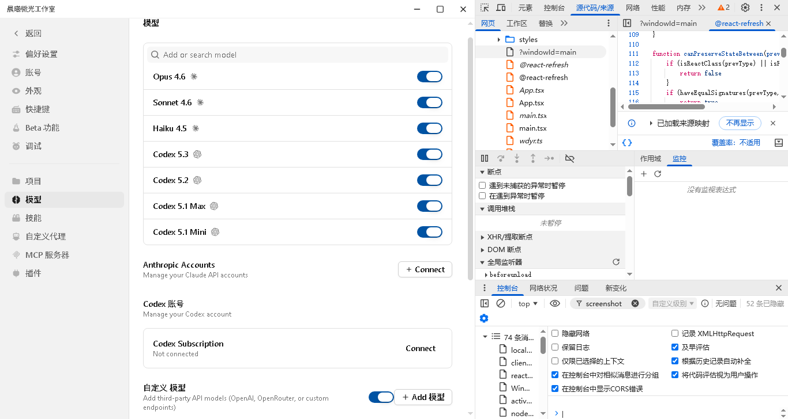
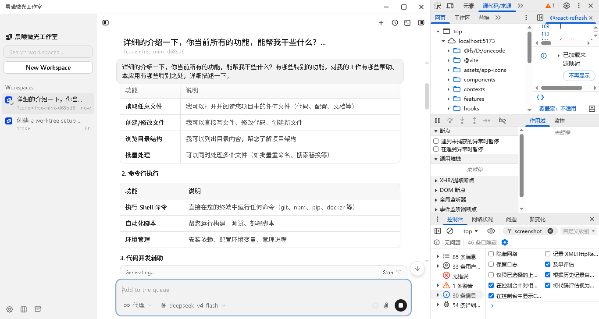
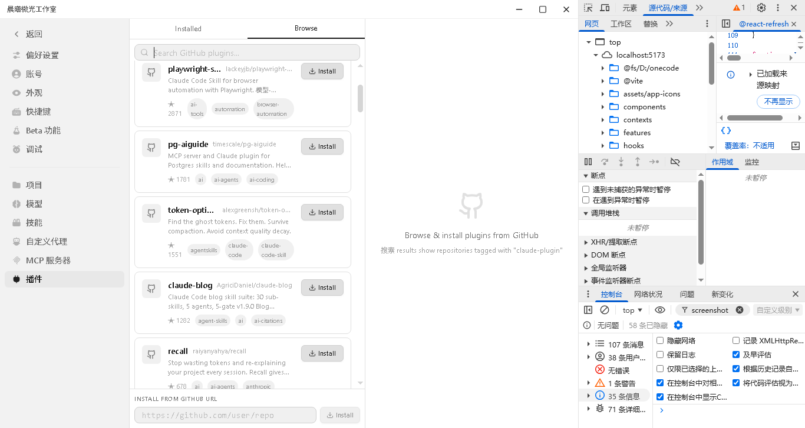
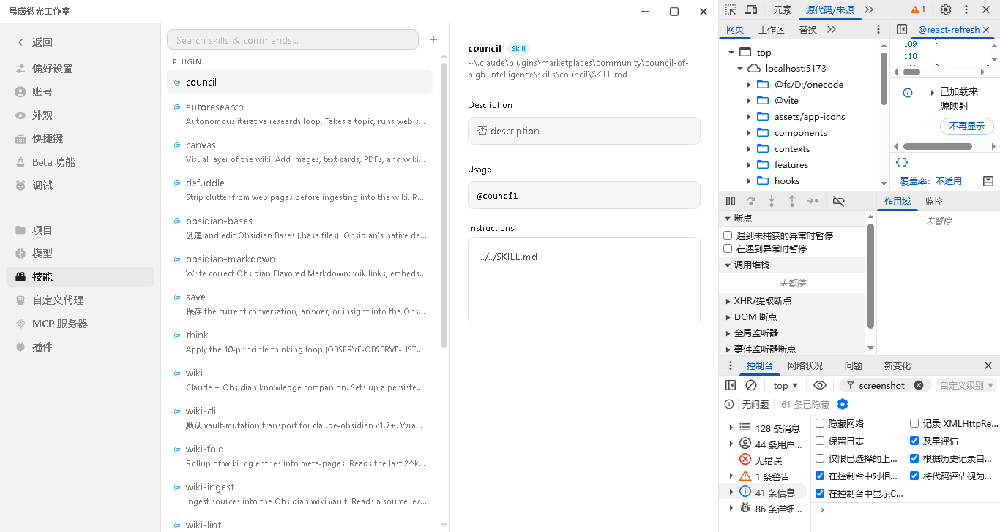

# Rapid Code 🚀

<p align="center">
  
  
  
  
  <a href="https://github.com/HS435116/rapid-code/discussions"></a>
</p>

---

<p align="center">
  
  <br>
  <em>Multi-agent split pane — run multiple AI agents side by side</em>
</p>

<p align="center">
  
  
  <br>
  <em>Chat interface (left) · Plugin marketplace (right)</em>
</p>

<p align="center">
  
  <br>
  <em>Settings page</em>
</p>

**Multi-agent AI coding assistant for desktop.**

Rapid Code is a desktop application that runs multiple AI coding agents in parallel on your local projects. It integrates Claude Code CLI and OpenAI-compatible APIs, giving AI agents full read/write access to your filesystem, Git operations, and shell commands — all in an intuitive split-pane interface.

---

## Features

### 🤖 Multi-Agent Parallelism
Run multiple Claude Code / Codex agents side by side. Each agent operates independently in its own split pane — watch them work simultaneously, compare approaches, or divide tasks across agents.

### 📁 Local Project Integration
Agents read and write real files in your project directory. No sandbox — they operate directly on your codebase, making changes you can see and review in real time.

### 🧩 Plugin System
Extend Rapid Code with community plugins. Each plugin can contribute Commands, Skills, Custom Agents, and MCP Servers.

### 🔌 MCP Server Support
Connect MCP servers to give agents access to external tools, APIs, and data sources. Built-in OAuth flow for authenticated servers.

### 🌲 Git Worktree Workspaces
Each chat session gets its own isolated Git worktree. Experiment freely without affecting your main branch.

### ⚡ Real-time Streaming
Watch agents think and act in real time via SSE streaming. Every file read, command execution, and reasoning step is displayed live.

### 🌐 Built-in Translation
Built-in Chinese/English translation engine for wider accessibility.

---

## Tech Stack

| Layer | Technology |
|-------|-----------|
| Desktop Shell | Electron |
| UI Framework | React 19 + TypeScript |
| Styling | TailwindCSS |
| State Management | Jotai |
| API Layer | tRPC |
| Database | SQLite (better-sqlite3) |
| AI SDK | @ai-sdk/react |

---

## Quick Start

### Prerequisites
- **Node.js** >= 18
- **npm** or **bun**
- **Git** (for worktree features)

### Install & Run

```bash
git clone https://github.com/your-org/rapid-code.git
cd rapid-code
npm install
npm run dev        # Development mode with hot reload
npm run build      # Production build
```

### Configure API

Create a `.env` file:

```env
# Anthropic API (recommended)
ANTHROPIC_AUTH_TOKEN=sk-ant-...
ANTHROPIC_BASE_URL=https://api.anthropic.com

# Or OpenAI-compatible API
ANTHROPIC_AUTH_TOKEN=your-key
ANTHROPIC_BASE_URL=https://api.openai.com/v1
```

---

## Usage

1. **Select a project** — Choose a local Git repository from the sidebar
2. **Create a chat** — Start a conversation with an AI agent
3. **Assign tasks** — Describe what you want the agent to do
4. **Watch it work** — The agent reads files, executes commands, and makes changes in real time
5. **Review changes** — Use the diff view to see what changed
6. **Branch & merge** — Each session creates its own Git worktree

---

## Project Structure

```
src/
├── main/              # Electron main process
│   ├── lib/plugins/   # Plugin discovery & GitHub catalog
│   ├── lib/trpc/      # tRPC routers
│   └── windows/       # Window management
├── renderer/          # React UI
│   ├── components/    # Shared UI components
│   ├── features/      # Feature modules (agents, sidebar, settings)
│   └── translator/    # Translation engine
└── preload/           # Electron preload scripts
```

---

## Community

- 💬 [GitHub Discussions](https://github.com/HS435116/rapid-code/discussions) — 讨论、反馈、Q&A
- 🐛 [GitHub Issues](https://github.com/HS435116/rapid-code/issues) — Bug 报告 & 功能建议
- 📖 [掘金文章: Rapid Code 介绍](https://juejin.cn/post/7659034306871492660)

---

## Contributing

Contributions welcome! Report bugs via Issues, submit features via Pull Requests.

---

## License

[MIT](LICENSE)
